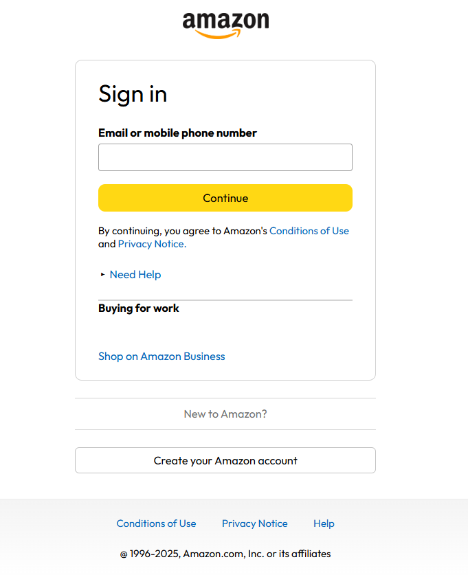

# 🛍️ Amazon Clone

A fully responsive **Amazon homepage clone** built using **HTML, CSS, and JavaScript**. This project replicates the look and feel of Amazon’s front page, including the header, product showcases, and footer.

## 🔥 Live Demo

👉 [Click here to view the live site](https://hlo-mayur.github.io/Amazon-clone/)  

---

## 📸 Preview

  

---

## 🛠️ Tech Stack

- **HTML** – Page structure and content
- **CSS** – Layout, styling, and responsiveness
- **JavaScript** – Basic interactivity like sliders, dropdowns, and navigation

---

## ✨ Features

- 🧭 Sticky and responsive navigation bar  
- 📱 Fully responsive layout for mobile & desktop  
- 🛒 Product showcase cards  
- 🎯 Image sliders and category sections  
- 🧩 Dropdowns and hover effects  
- 📦 Recreated footer and Amazon styling

---